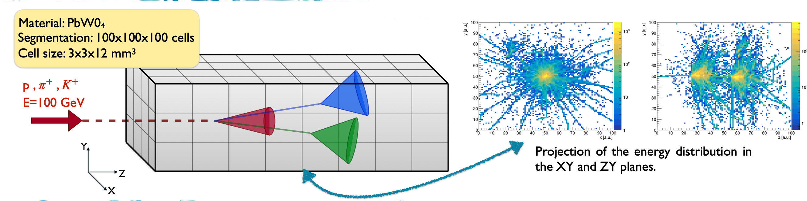

# TowardPIDwithGranularCalorimeters

This study investigates whether high-granularity hadronic calorimeters can differentiate between protons, charged pions, and kaons by analyzing detailed energy deposition patterns, with promising preliminary results from Geant4 simulations

## Machine Learning Strategy

Our work proposes the use of XGBoost Boosted Decision Trees (BDTs) to analyse descriptive features for each event. The approach includes a preprocessing step that generates variables for each event, which are then input into the machine learning algorithm.
Hyperparameter optimization is conducted using GridSearch, exploring different configurations, including the choice of booster and tree method type.

## Meaningful Shower Features

To study particle interactions, identifying the primary interaction vertex is crucial, as it reveals key information about the particle. Detector segmentation, particularly longitudinal, enables detailed analysis of the shower's energy profile. A moving window algorithm helps locate the primary vertex near an energy peak. Further studies can focus on the energy around the vertex, its relationship to secondary vertices, and shower dimensions, including average size and asymmetries from non-interacting secondary particles.


# How to Use

## Prerequisites
For the pipeline:
* root
* nohup

## Arguments Manager
The `args_manager` handles the parameter management for the pipeline executables.

### Compilation
To compile the `args_manager`:
```bash
cd features
g++ -std=c++11 -o args_manager src/fileManager.cc
```

## Features Analysis
The following executables are used for feature analysis:
1. firstVertex
2. generalFeatures
3. missingEnergy
4. spatialObservables
5. speed
6. topPeaks

### Compilation
To compile an executable:
```bash
g++ -Ofast -g src/<file>.cc src/utils.cc `root-config --cflags` -o <file> -L$(root-config --libdir) -Wl,-rpath,$(root-config --libdir) -lCore -lRIO -lNet -lHist -lGraf -lGraf3d -lGpad -lTree -lRint -lPostscript -lMatrix -lPhysics -lMathCore -lThread -lMultiProc -lROOTVecOps -pthread -lm -ldl -lSpectrum
```
Repeat this step for each of the executables listed above.

## How to Use `args_manager`
The `args_manager` is used to define parameters for the executables based on the segmentation you want to analyze.

### Execution
```bash
[user@mycomputer features]$ ./args_manager
Enter the name of the executable: <executableName>
Enter the segmentation to update (format x_y_z): <x_y_z>
Enter the values to associate with the segmentation (separated by space): <a b c d>
```

## How to Use the Pipeline
The `exec_pipeline` script orchestrates the execution of the compiled features analysis executables.

### Execution
```bash
[user@mycomputer features]$ ./execPipeline.sh
Enter the segmentation (format x_y_z): <x_y_z>
```

## Folder Structure
The project folder is organized as follows:

```
TowardPID
|
|---->features
         |
         |-----> src
         |-----> include
         |-----> args
         |-----> log
|---->dataset
|---->analysis
|---->results
```

- **src**: Contains the source files for the executables and the arguments manager.
- **include**: Header files for the project.
- **args**: Stores the TSV files generated by the `args_manager` with the parameters defined for each segmentation.
- **log**: Contains log files created by the `exec_pipeline`.
- **results**: Contains output files produced by the pipeline executables.

## Notes
- Ensure that all dependencies (e.g., ROOT) are correctly installed and configured on your system.
- Log files in the `log` directory provide useful debugging information if issues arise during execution.

